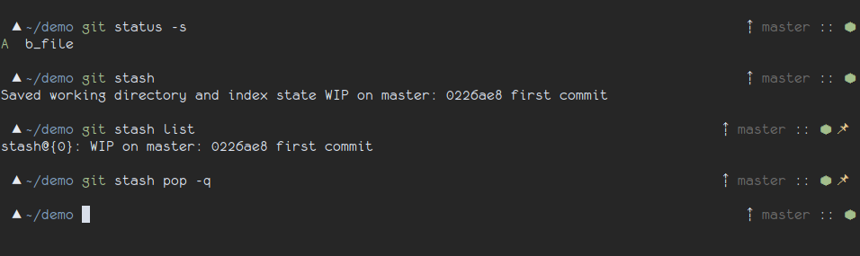

# Git stashes
[Geometry's](https://github.com/geometry-zsh/geometry) prompt plugin to show if "git stashes" exist



## Installation

It is included in the geometry theme.

## Configuration

```sh
GEOMETRY_COLOR_GIT_STASHES=yellow
GEOMETRY_SYMBOL_GIT_STASHES=📌
```
